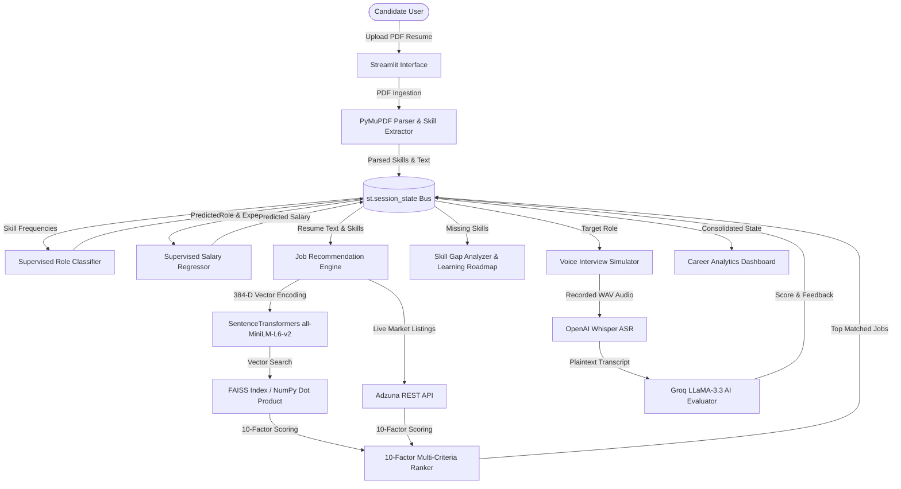

# CareerPilot AI — Autonomous AI Career Copilot & Intelligence Platform

> An AI-powered career intelligence platform that analyzes resumes, predicts career paths, recommends relevant jobs, generates personalized learning roadmaps, conducts AI-powered mock interviews, and provides actionable career analytics.

---


---

## 📖 Table of Contents

- [Features](#-features)
- [Demo Gallery](#-demo-gallery)
- [Complete System Workflow](#-complete-system-workflow)
- [Tech Stack](#-tech-stack)
- [Project Architecture](#-project-architecture)
- [AI & Machine Learning](#-ai--machine-learning)
- [Key Highlights](#-key-highlights)
- [Installation Guide](#-installation-guide)
- [Environment Variables](#-environment-variables)
- [How It Works](#-how-it-works)
- [Future Improvements](#-future-improvements)
- [Author](#-author)
- [License](#-license)

---

## ⚡ Features

CareerPilot AI V2 features **12 integrated modules** organized into **4 Product Studios** and platform views:

### 📄 Resume Studio
- **Resume Intelligence**: Parses PDF resumes via PyMuPDF (`fitz`), extracts structural sections, and isolates 150+ technical competencies using ML & regex patterns.
- **ATS Score**: Algorithmic scoring of candidate resumes against job descriptions, calculating keyword overlap, entity density, and format compliance.
- **Resume Feedback**: Section-by-section strength and weakness critique powered by LLM reasoning.
- **Resume Rewriter**: Generates single, complete High-ATS rewritten bullet points using Groq LLaMA-3.3 and the XYZ formula (*Accomplished X, as measured by Y, by doing Z*).

### 🎯 Career Intelligence
- **Role Prediction**: Supervised Multiclass ML Classification model (Random Forest / Naive Bayes) predicting target job titles based on skill distributions.
- **Salary Prediction**: Supervised ML Regression model (Ridge Regressor) forecasting annual compensation curves based on role, experience level, and location.
- **AI Job Recommendation Engine**: 10-factor multi-criteria semantic vector recommendation engine combining 384-dimensional dense Transformer embeddings (`all-MiniLM-L6-v2`), FAISS vector search, NumPy dot-product fallback, and live Adzuna REST API market listings.

### 🎓 Learning Studio
- **Learning Roadmap**: Skill-gap analyzer detecting missing technical competencies for target roles and generating week-by-week milestone study guides with portfolio project ideas.

### 🎤 Interview Lab
- **AI Interview Questions**: Category-wise (Technical, Behavioral, System Design) question generator tailored to predicted target roles.
- **Voice Mock Interview**: Interactive voice mock interview simulator featuring browser audio recording (`st_audiorec`), OpenAI Whisper speech-to-text, and automated AI scoring.
- **AI Evaluation Report**: Detailed performance breakdown evaluating STAR methodology adherence (*Situation, Task, Action, Result*), clarity, and technical correctness.

### 📊 Career Analytics
- **Career Dashboard**: Executive dashboard consolidating resume match scores, skill distribution charts, salary benchmarks, and job search metrics.

---

## 🖼 Demo Gallery

| Module View | Preview Screenshot |
| :--- | :--- |
| **Home Landing Page** |  |
| **Resume Intelligence** |  |
| **Career Intelligence** |  |
| **Job Recommendation Engine** |  |
| **Learning Roadmap** |  |
| **Voice Mock Interview Lab** |  |
| **Career Analytics Dashboard** |  |

---

## 🔄 Complete System Workflow



---

## 🛠 Tech Stack

### Frontend & Styling
| Technology | Purpose |
| :--- | :--- |
| **Streamlit 1.40+** | Reactive Web UI Framework |
| **Vanilla CSS3 / HSL Tokens** | Obsidian Dark Theme & Glassmorphism Panels |

### Backend & Core Logic
| Technology | Purpose |
| :--- | :--- |
| **Python 3.14** | Primary Runtime Environment |
| **PyMuPDF (`fitz`)** | Fast C-Backed PDF Text & Section Extractor |
| **NumPy & Pandas** | High-Performance Matrix Operations & Data Wrangling |
| **Joblib** | Model Serialization & Asset Loading |

### Machine Learning & Vector Search
| Technology | Purpose |
| :--- | :--- |
| **Scikit-Learn** | Random Forest Classifier & Ridge Salary Regressor |
| **PyTorch** | Deep Learning Framework underlying SentenceTransformers |
| **SentenceTransformers** | Dense Vector Encoding (`all-MiniLM-L6-v2`, 384 Dimensions) |
| **FAISS / NumPy Engine** | Sub-5ms Cosine Inner-Product Similarity Search with NumPy Fallback |

### Artificial Intelligence & Cloud APIs
| Technology | Purpose |
| :--- | :--- |
| **Groq LLaMA-3.3-70B API** | Ultra-Fast Cloud LLM Reasoning & Bullet Rewriting (300+ tok/s) |
| **OpenAI Whisper ASR** | Automatic Speech Recognition for Voice Interview Transcription |
| **Adzuna REST API** | Live Job Search Integration across US, UK, India |

---

## 📁 Project Architecture

```
c:\projects\CareerPilot-AI\
├── app.py                          # Application Entry Point & Page Router
├── requirements.txt                 # Dependencies (utf-16le)
├── README.md                        # Project Documentation
├── LICENSE                         # MIT License
├── .env                            # API Keys & Configuration
│
├── assets/                          # Static Graphics & Screenshots
│   ├── logo.svg                     # SVG Brand Logo
│   └── screenshots/                 # Demo Screenshots
│
├── components/                      # UI Component & Styling Subsystem
│   ├── sidebar.py                   # Enterprise Sidebar Navigation Component
│   └── styles.py                    # Global CSS Design Tokens & Glassmorphic Rules
│
├── career_recommendation/           # Vector Search & Job Recommendation Subsystem
│   ├── adzuna_client.py             # Adzuna REST Search API Client
│   ├── config.py                    # Dataset Paths & Constants
│   ├── dataset_loader.py            # Dataset Ingestion Utility
│   ├── embedding_engine.py          # SentenceTransformers Vector Encoder
│   ├── faiss_index.py               # FAISS Index & Fallback Guard
│   ├── inference.py                 # Recommendation Engine Facade
│   ├── model_loader.py              # Singleton Asset Loader (@st.cache_resource)
│   ├── preprocessor.py               # Dataset Ingestion Engine
│   ├── ranker.py                    # 10-Factor Scoring Model & Vector Search
│   └── recommendation_engine.py     # Live Adzuna + Vector Search Orchestrator
│
├── datasets/                        # Pre-computed Datasets & Embedding Files
│   └── internship_recommendation/
│       ├── raw/                     # Raw CSV Files
│       ├── processed/               # Merged Processed CSV (career_jobs.csv)
│       └── embeddings/              # Dense Embeddings (career_embeddings.npy, career_metadata.pkl)
│
├── interview_preparation/           # Interview Question Generator Subsystem
├── learning_roadmap/                # Skill Gap Analyzer & Roadmap Generator
├── resume_analyzer/                 # Resume Parsing & Skill Extractor ML
├── role_prediction/                 # Supervised Role Classification Model
├── salary_prediction/               # Supervised Salary Regression Model
│
├── src/                             # Shared Utilities & System Services
│   ├── parsers/                     # PDF Parsers (extract_text, extract_sections)
│   ├── ml/                          # Shared ML Utilities (skill_extractor)
│   └── utils/                       # Session Manager (initialize_session, process_resume)
│
├── views/                           # 12 Streamlit UI Page Views
│   ├── about_platform.py            # About Platform Static SaaS View
│   ├── ats_score.py                 # ATS Score UI
│   ├── career_analytics.py          # Career Analytics Dashboard UI
│   ├── home.py                      # Landing Page UI
│   ├── interview_questions.py       # Interview Questions UI
│   ├── job_recommendations.py       # Job Recommendation Engine UI
│   ├── learning_roadmap.py          # Learning Roadmap UI
│   ├── resume_analysis.py           # Resume Intelligence UI
│   ├── resume_feedback.py           # Resume Feedback UI
│   ├── resume_rewriter.py           # Resume Rewriter UI
│   ├── role_prediction.py           # Role Prediction UI
│   ├── salary_prediction.py         # Salary Prediction UI
│   └── voice_interview.py           # Voice Mock Interview UI
│
└── voice_interview/                 # Voice Speech-to-Text & Feedback Subsystem
```

---

## 🤖 AI & Machine Learning

- **Random Forest**: Supervised multiclass classifier mapping extracted skill frequencies to target job titles.
- **Ridge Regression**: Regularized regression model predicting market compensation benchmarks based on role, experience, and location.
- **SentenceTransformers**: `all-MiniLM-L6-v2` dense Transformer mapping candidate profiles into a 384-dimensional continuous vector space.
- **Groq LLaMA-3.3-70B**: High-speed cloud LLM executing ATS bullet rewriting, section feedback, and mock interview evaluation.
- **OpenAI Whisper**: Automatic Speech Recognition (ASR) transcribing candidate audio responses into plaintext.
- **FAISS**: Facebook AI Similarity Search `IndexFlatIP` indexing 12,217 pre-computed job embeddings for fast retrieval.
- **NumPy Cosine Similarity**: Automated fallback engine executing matrix dot-product similarity search (`np.dot`) if FAISS C++ binaries are absent.

---

## ⭐ Key Highlights

- **Privacy-First Parsing**: Local PDF text extraction via PyMuPDF without storing candidate resumes in cloud databases.
- **Algorithmic ATS Matching**: Computes structural section alignment, keyword density, and missing skills against target Job Descriptions.
- **10-Factor Multi-Criteria Recommendation Engine**: Combines semantic similarity, skill coverage %, title trajectory, normalized experience level, and salary alignment.
- **Resilient Fallback Search Engine**: Gracefully falls back from FAISS to NumPy matrix dot-product vector search in <5 milliseconds without system crashes.
- **Interactive Voice Simulation**: Simulates real-time mock interviews with speech-to-text transcript generation and STAR metric scoring.
- **Glassmorphic UI Design**: Dark obsidian SaaS layout with HSL design tokens, responsive cards, and zero visual clutter.

---

## 🚀 Installation Guide

### Prerequisites
- Python 3.10+ (Recommended: Python 3.14)
- Git

### 1. Clone Repository
```bash
git clone https://github.com/nandini3206/CareerPilot-AI.git
cd CareerPilot-AI
```

### 2. Create Virtual Environment
```bash
python -m venv venv
# On Windows:
venv\Scripts\activate
# On macOS/Linux:
source venv/bin/activate
```

### 3. Install Dependencies
```bash
pip install -r requirements.txt
```

### 4. Configure Environment Variables
Create a `.env` file in the root directory:
```ini
GROQ_API_KEY=your_groq_api_key_here
ADZUNA_APP_ID=your_adzuna_app_id_here
ADZUNA_API_KEY=your_adzuna_api_key_here
```

### 5. Launch Application
```bash
streamlit run app.py
```
Open your browser at `http://localhost:8501`.

---

## 🔑 Environment Variables

| Variable Name | Required | Description |
| :--- | :---: | :--- |
| `GROQ_API_KEY` | **Yes** | API Key for Groq Cloud LLaMA-3.3-70B LLM reasoning & rewriting. |
| `ADZUNA_APP_ID` | Optional | Application ID for live Adzuna market job search. |
| `ADZUNA_API_KEY` | Optional | API Key for live Adzuna market job search. |

*Note: If Adzuna keys are unconfigured, the system automatically uses the local 12,217 vector job dataset.*

---

## 🧠 How It Works

1. **Ingestion & Extraction**: Candidate uploads a PDF resume. PyMuPDF parses raw text, extracts structural sections, and canonical skill dictionaries extract 150+ technical competencies.
2. **Supervised Inference**: Skill frequencies pass to Scikit-Learn models to predict target job titles (e.g. *Machine Learning Engineer*) and market salary ranges.
3. **Dense Vector Search**: Candidate profile text is encoded into a 384-dimensional vector using `SentenceTransformer('all-MiniLM-L6-v2')`.
4. **Multi-Criteria Ranking**: Vector search engine executes inner dot-product matching over 12,217 pre-computed job embeddings. A 10-factor multi-criteria model ranks results across skill coverage %, experience level, title match, and salary alignment.
5. **Generative Coaching**: Candidate receives week-by-week learning roadmaps for missing skills, practices voice mock interviews evaluated by Whisper + Groq LLaMA-3.3, and tracks progress via Career Analytics.

---

## 🔮 Future Improvements

- **Distributed Vector Database**: Migrate local `.npy` vector storage to Qdrant or Pinecone for multi-tenant scalability.
- **Automated Tailored PDF Generator**: Enable single-click export of rewritten High-ATS resumes to PDF using ReportLab.
- **WebRTC Real-Time Audio**: Upgrade audio recording from post-recording upload (`st_audiorec`) to real-time WebRTC audio streaming.
- **Multi-Language Resume Parsing**: Expand parser support to multilingual resumes (French, German, Spanish).

---

## 👩‍💻 Author

**Nandini Bhatt**
- GitHub: [nandini3206](https://github.com/nandini3206)
- LinkedIn: [Nandini Bhatt](https://linkedin.com/in/nandini-bhatt)

---

## 📜 License

This project is licensed under the MIT License - see the [LICENSE](LICENSE) file for details.
