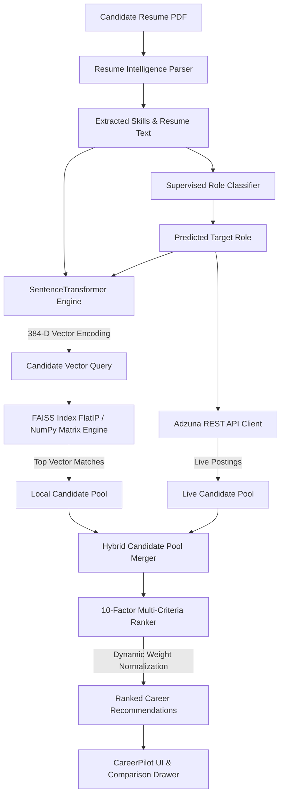

# Career Recommendation Engine

The **Career Recommendation Engine** is a core intelligence module of **CareerPilot AI V2**. Its primary purpose is to match candidate resumes against global career opportunities by synthesizing dense vector semantic search, supervised machine learning outputs (predicted job roles and salary baselines), candidate skill extractions, and live REST API market listings from Adzuna.

Rather than relying on naive keyword matching, this module maps candidate profile text into a continuous 384-dimensional vector space and applies an intelligent 10-factor multi-criteria ranking algorithm to deliver explainable, highly accurate career recommendations.

---

## ⚡ Features

- **Semantic Resume-to-Job Matching**: Encodes candidate profiles using Transformer neural networks to capture deep contextual semantics beyond raw keywords.
- **SentenceTransformer Embeddings**: Employs `all-MiniLM-L6-v2` to generate 384-dimensional $L_2$-normalized vector representations.
- **Hybrid Vector Search**: Integrates 12,217 pre-computed job embeddings with live Adzuna REST API market results.
- **Intelligent Multi-Factor Job Ranking**: Ranks candidates using a 10-factor scoring model ($S_{total} \in [0, 100]$).
- **Resume Skill Matching**: Calculates skill coverage percentages against job requirements.
- **Predicted Role Matching**: Aligns job postings with ML-predicted role trajectories.
- **Experience Level Matching**: Evaluates level proximity across Intern, Entry, Junior, Mid, Senior, and Lead tiers.
- **Salary Compatibility**: Compares employer salary ranges against candidate predicted benchmarks.
- **Location Alignment**: Evaluates exact location matches, remote flexibility, and relocation preferences.
- **Live Adzuna Job Integration**: Real-time fetching of active market job postings via Adzuna REST API.
- **Explainable Match Score**: Breaks down match percentages into clear human-readable match rationale.
- **Recommendation Reasons**: Generates transparent, factor-by-factor bullet points explaining why a job was recommended.
- **Learning Roadmap Integration**: Identifies missing skill gaps to power downstream learning roadmap generation.
- **Save & Compare Jobs**: Supports bookmarking and side-by-side metric comparison for up to 4 job listings.
- **Graceful FAISS ➔ NumPy Fallback**: Seamlessly falls back from C++ native FAISS vector search to NumPy matrix dot-product similarity (`np.dot`) if FAISS is uninstalled, ensuring zero system downtime.

---

## 🏗 Module Architecture

---

## 📁 Folder Structure

| File Name | Purpose & Responsibilities |
| :--- | :--- |
| **`inference.py`** | High-level Facade interface exposing `.recommend()` method for Streamlit views. |
| **`recommendation_engine.py`** | Orchestrates hybrid search by dispatching queries to vector index and Adzuna API. |
| **`ranker.py`** | Implements the 10-factor multi-criteria scoring algorithm and NumPy dot-product fallback search. |
| **`embedding_engine.py`** | Wraps `SentenceTransformer('all-MiniLM-L6-v2')` for generating dense 384-D vectors. |
| **`faiss_index.py`** | Constructs and manages FAISS `IndexFlatIP` indices with fallback detection guards. |
| **`model_loader.py`** | Singleton asset loader using `@st.cache_resource` to cache embeddings and metadata in memory. |
| **`adzuna_client.py`** | REST API client for querying live job postings from the Adzuna Search API. |
| **`dataset_loader.py`** | Ingests and cleans raw multi-source job dataset CSV files. |
| **`preprocessor.py`** | Merges raw CSV datasets, cleans text fields, and builds unified `career_jobs.csv`. |
| **`config.py`** | Central configuration file defining file paths, embedding dimensions, weights, and API keys. |

---

## 📊 Ranking Algorithm

The engine ranks candidate-job pairs using a 10-factor multi-criteria scoring function. Each factor score $s_k(j) \in [0, 100]$ is weighted by coefficient $w_k$:

$$S_{total}(j) = \sum_{k=1}^{10} w_k \cdot s_k(j)$$

| Factor Weight | Metric Name | Description & Calculation |
| :---: | :--- | :--- |
| **30%** | Semantic Vector Similarity | Inner dot product between L2-normalized candidate vector and job vector ($\mathbf{u} \cdot \mathbf{v}$). |
| **15%** | Skill Coverage % | Percentage of job required skills present in candidate resume ($\frac{|\text{Cap} \cap \text{Req}|}{|\text{Req}|}$). |
| **15%** | Keyword Match Score | TF-IDF cosine similarity between resume text string and job description text. |
| **10%** | Role Title Match | Token overlap between candidate predicted role and job posting title. |
| **10%** | Experience Proximity | Proximity score across Intern ➔ Entry ➔ Junior ➔ Mid ➔ Senior ➔ Lead experience tiers. |
| **10%** | Salary Compatibility | Ratio of posting salary to candidate predicted baseline salary range. |
| **5%** | Location Alignment | Exact match (100%), Remote (85%), Relocation (40%). |
| **5%** | Employment Type Match | Match score for Full-Time, Contract, Internship, or Part-Time designations. |

### Dynamic Weight Normalization
If a job posting lacks salary metadata (common in public postings), the salary weight factor is set to $w_6 = 0$. The remaining factor weights are dynamically re-normalized:

$$w_k' = \frac{w_k}{\sum_{m \neq 6} w_m}$$

This prevents candidate match scores from being penalized due to missing employer compensation disclosures.

---

## 💻 Technologies Used

- **Python 3.14**: Core programming language.
- **SentenceTransformers**: Dense neural vector encoding (`all-MiniLM-L6-v2`).
- **FAISS (`faiss-cpu`)**: Native C++ similarity search (`IndexFlatIP`).
- **NumPy**: Matrix dot-product vector search (`np.dot`) fallback engine.
- **Pandas**: Structured dataset processing and metadata filtering.
- **Scikit-learn**: Cosine similarity and TF-IDF feature extraction.
- **Requests**: HTTP client for Adzuna REST API integrations.
- **Adzuna REST API**: Real-time market job listing provider.

---

## 🔄 Workflow

1. **Profile Synthesis**: User uploads resume PDF. Extracted skills and predicted role are loaded from `st.session_state`.
2. **Embedding Generation**: Candidate text is encoded into a 384-dimensional dense vector $\mathbf{u} \in \mathbb{R}^{384}$.
3. **Vector Querying**: `faiss_index.py` or NumPy `ranker.py` computes inner product scores across 12,217 pre-computed job vectors.
4. **Live Market Querying**: `adzuna_client.py` concurrently queries live job listings matching the predicted role.
5. **Candidate Pool Merging**: Local vector results and live API listings are unified into a single candidate pool.
6. **Multi-Factor Scoring**: `ranker.py` evaluates all candidate-job pairs using the 10-factor scoring formula with dynamic weight normalization.
7. **UI Rendering**: Ranked results are presented as interactive job cards in Streamlit with match scores, skill gap badges, bookmarking, and comparison drawer support.

---

## 🛡 Error Handling

- **Missing FAISS Binary**: Caught via `try...except ImportError`; sets `HAS_FAISS = False` and routes vector queries through NumPy matrix multiplication (`np.dot(self.embeddings, query)`).
- **Adzuna API Failure / Network Offline**: Caught via `requests.RequestException`; gracefully falls back to local pre-computed dataset without UI error banners.
- **Empty Recommendations**: If filters produce zero results, the engine relaxes location/experience constraints and returns top semantic matches.
- **Missing Resume Upload**: Guarded by `session_manager.py` state checks, displaying an informative upload prompt in the UI.
- **Missing Embeddings File**: `model_loader.py` verifies `.npy` and `.pkl` asset existence before startup and logs clear diagnostics if files are missing.

---

## 🔮 Future Improvements

- **Qdrant / Pinecone Integration**: Migrate local `.npy` vector files to a distributed vector database for multi-tenant cloud deployments.
- **Enhanced Skill Synonym Graph**: Implement graph-based skill ontology matching (e.g. mapping `ReactJS` ➔ `Frontend` ➔ `JavaScript`).
- **Real-Time Market Salary Trends**: Incorporate dynamic market salary benchmarking based on live Adzuna salary distributions.